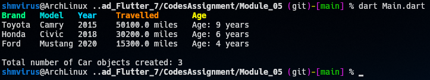

## Question

Create a class Car with the following properties:
- brand: a string representing the brand of the car
- model: a string representing the model of the car
- year: an integer representing the year the car was made
- milesDriven: a double representing the number of miles driven by the car

The class should have the following methods:
- drive(double miles): a method that takes a double parameter representing the number of miles driven and adds it to the milesDriven property
- getMilesDriven(): a method that returns the value of the milesDriven property
- getBrand(): a method that returns the value of the brand property
- getModel(): a method that returns the value of the model property
- getYear(): a method that returns the value of the year property
- getAge(): a method that returns the age of the car (i.e. the difference between the current year and the year property)

The class should also have a static property called numberOfCars that keeps track of the number of Car objects that have been created. This property should be incremented every time a Car object is created.

> In the main() function, create three Car objects with different brands, models, and years. Drive each car a different number of miles using the drive() method. Print out the brand, model, year, and miles driven for each car using the getBrand(), getModel(), getYear(), and getMilesDriven() methods, respectively. Also print out the age of each car using the getAge() method. Finally, print out the total number of Car objects created using the numberOfCars static property.

## Output
