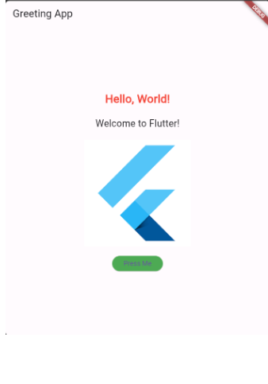
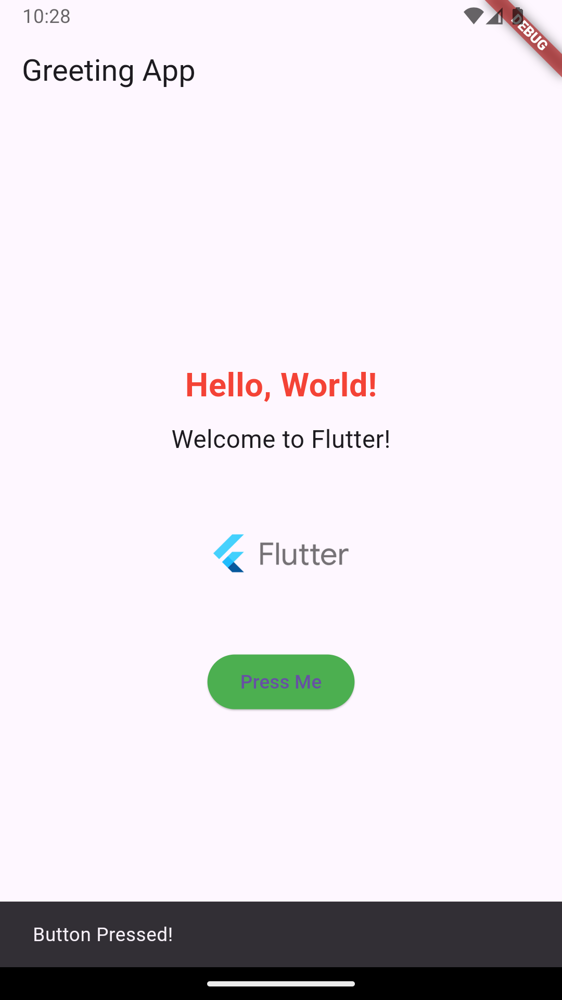

## Objective
To extend the given Flutter app by adding more widgets and functionality to understand the use of various Flutter widgets and basic interaction handling.

## Instructions
1. Display Additional Text:
   > Below the existing "Hello, World!" text, add another Text widget that says "Welcome to Flutter!".
2. Add an Image(Optional):
   > Add an image below the new text. You can use any image URL from the internet or add an image to your project's assets folder and use it.
3. Interactive Button:
   > Modify the button so that when it is pressed, it shows a Snackbar with the message "Button Pressed!".
4. Custom Styling:
   > Change the text color of the "Hello, World!" message to red and make it bold. Change the button color to green.

## Output
