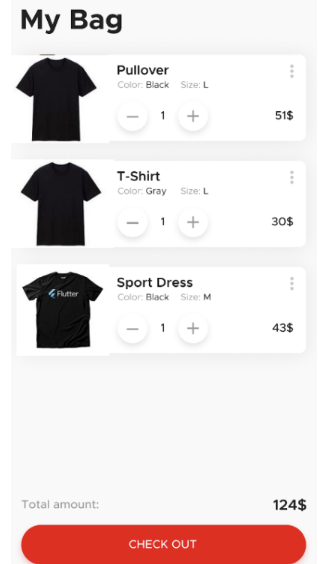
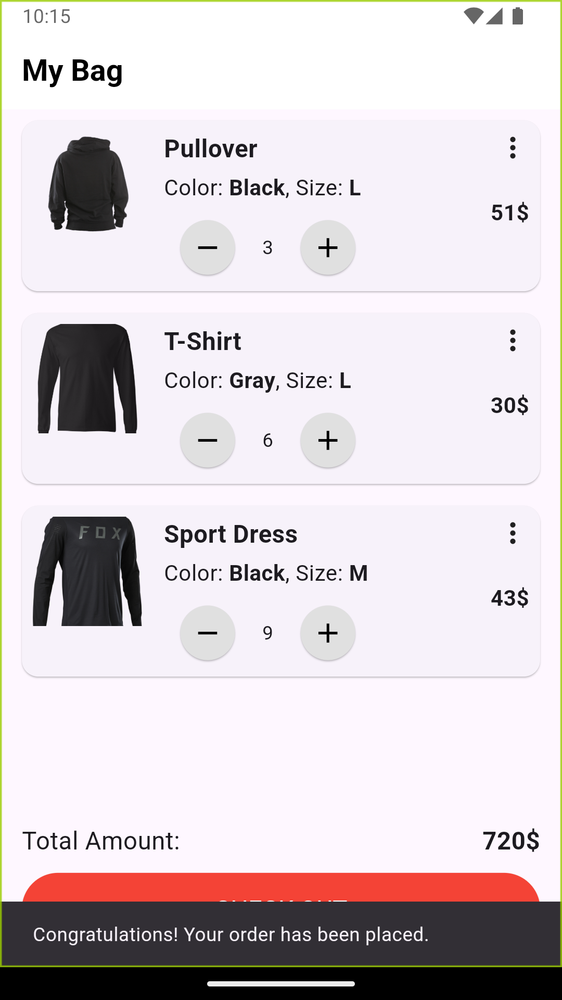

## Instructions
1. On pressing the + and - icons: The no of item will increase/decrease.
2. Total amount will be the calculated according to the number of items and unit price.
3. On pressing CHECK OUT a snackbar will appear with a congratulating message.

## Output
