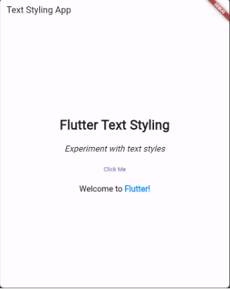
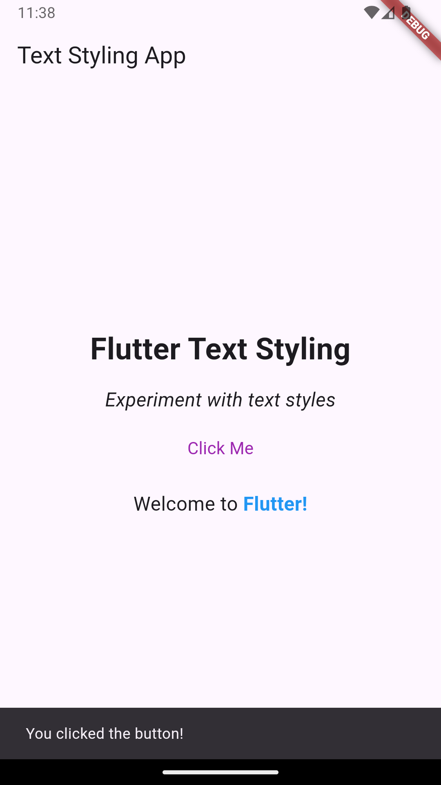

## Objective
 To practice working with Flutter's Text widget and Snackbar by implementing various text styles and handling user interactions.
 
## Instructions
1. Add a Title and Subtitle:
   > Add a Text widget at the top of the screen that serves as a title with the text "Flutter Text Styling".\
   > Below the title, add a Text widget for the subtitle with the text "Experiment with text styles".
2. Text Formatting:
   > Apply different styles to the title and subtitle. The title should be bold and larger, while the subtitle should be italicized and smaller.
3. Text Alignment:
   > Center-align the title and subtitle horizontally and vertically on the screen.
4. Interactive Text:
   > Add a TextButton below the subtitle that, when pressed, displays a Snackbar with the message "You clicked the button!".

## Output
